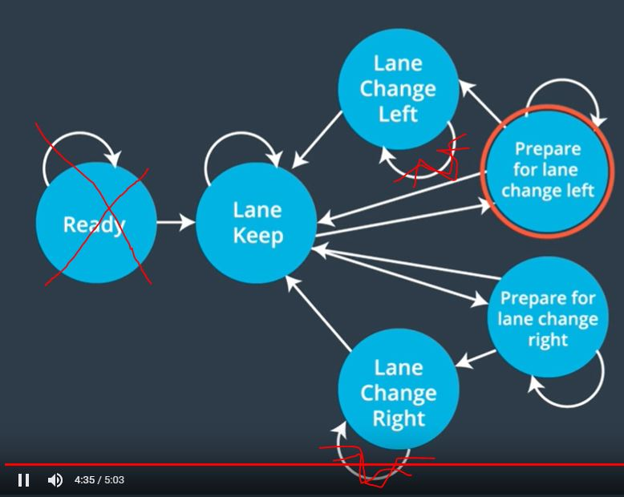
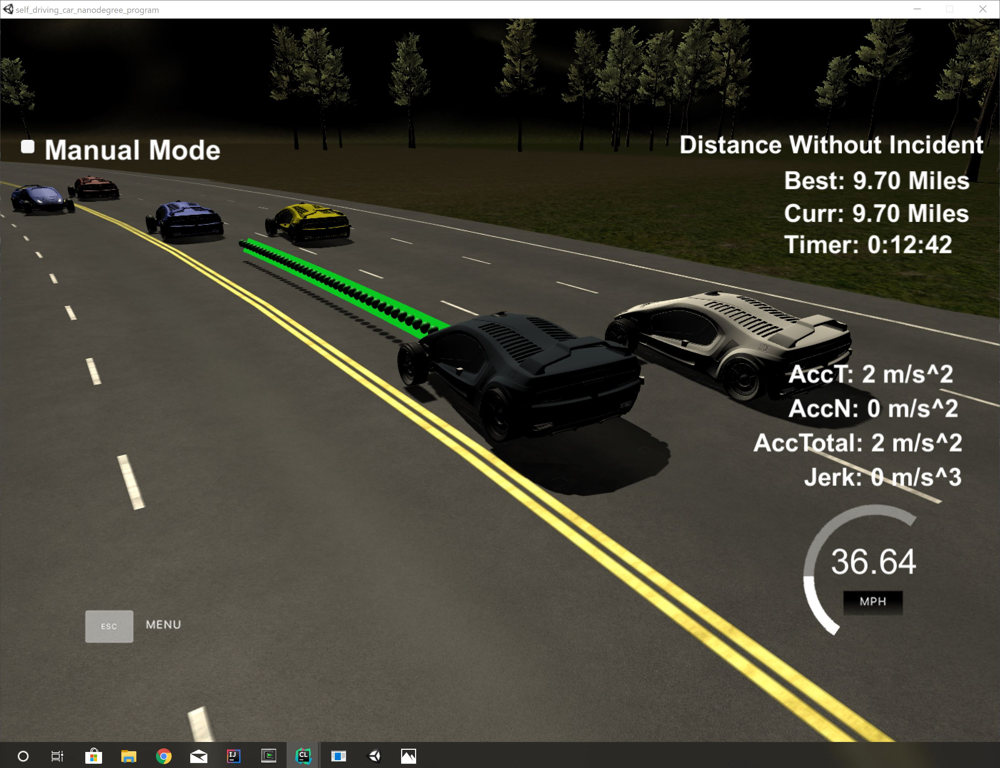
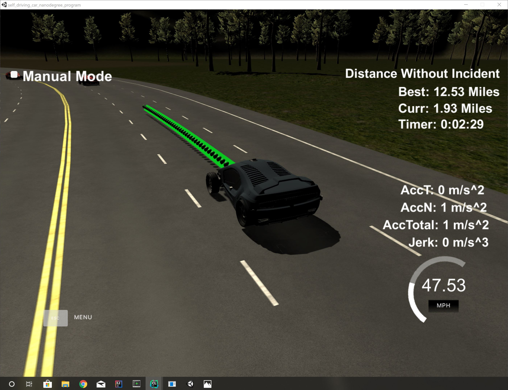

# Path Planning Project

**Writeup Report**

The following rubric points are addressed:

* The code model for generating paths is described in detail.

## Model Documentation

The model for generating trajectories can be mainly divided into the following components:

* State Machine ([State.h](src/state/State.h))
* Trajectory Generator ([TrajectoryGenerator.h](src/state/TrajectoryGenerator.h))

#### State Machine
The state machine is the core component of the trajectory generation model.
Similar to the lessons, the following states and their transitions are implemented:



* **Ready**: This state was omitted in the implementation. 
* **Keep Lane**: This state keeps the current lane.
* **Prepare for Lane Change Left** (PLCL): This state keeps either the lane or turns into a lane change left (LCL).
* **Lane Change Left** (LCL): Performs a left lane change and immediately turns into Keep Lane state.
* **Prepare for Lane Change Right** (PLCL): This state keeps either the lane or turns into a lane change left (LCL).
* **Lane Change Right** (LCR): Performs a right lane change and immediately turns into Keep Lane state.

It turned out that each state needs to satisfy the following three conditions to implement the `State` interface: 

* It returns its possible successor states:
```c++
virtual std::vector<std::unique_ptr<State>> Next_States(std::shared_ptr<Model> model_) = 0; 
``` 
* It provides the costs for a possible transition to it
```c++
virtual double Cost() const = 0;
``` 

* It is able to add spline points depending on the current or the target lane
```c++
virtual void Add_Spline_Points(std::vector<double> &spline_points_x, std::vector<double> &spline_points_y) const;
```

Each instance of `State` has a method
```c++
Trajectory Next_Trajectory(const std::unique_ptr<Trajectory> &prev_traj) const;
``` 
implemented by the base class `State`. Most of the common trajectory generation code resides there. It internally uses
the polymorphic `void Add_Spline_Points(...)` function to account for the state specific behaviour. One of the most 
challenging part was the velocity control of the vehicle. It is implemented in `Trajectory State::Break_Up_Spline_Points(...)`
in `State.cpp` in the first section of this function. It computes a maximum acceleration based on previous measurements 
to reduce acceleration limit exceedance in the simulation. By doing so, a good but yet improvable acceleration
behaviour can be observed. 
  
#### Trajectory Generator

The trajectory generator, implemented in [TrajectoryGenerator.cpp](src/TrajectoryGenerator.cpp), 
uses the state machine and decides by a minimum cost approach for the next state transition.

First off all the internal state gets initialized in the constructor by a `KeepLane` instance. 
```c++
TrajectoryGenerator::TrajectoryGenerator(std::shared_ptr<const MapWaypoints> map_waypoints) :
        map_waypoints_(map_waypoints)
{
    state_ = std::move(std::make_unique<KeepLane>(map_waypoints, nullptr, 1,
                                                  std::list<std::shared_ptr<Model>>()));
}
```
The public interface provides a method called
```c++
Trajectory TrajectoryGenerator::Next_Trajectory(std::unique_ptr<Trajectory> &&previous_traj,
                                                std::unique_ptr<Model> &&model)
```
The caller provides the previous trajectory from the simulation and the model. 
```c++
struct Trajectory
{
    std::vector<double> path_x;
    std::vector<double> path_y;
};

struct Model {
    EgoState ego_state;
    Sensors sensors;
};
```
I refer to [Types.h](src/Types.h) and includes for other type definitions.

In this `TrajectoryGenerator::Next_Trajectory(...)` method all possible next successor states `state_->Next_States(...)` 
get called for their costs `state->Cost()`:

```c++
{   
    //...

    std::vector<std::pair<std::unique_ptr<State>, double>> states_and_costs;
    for (auto &state :  state_->Next_States(sh_model))
    {
        double cost = state->Cost();
        states_and_costs.emplace_back(std::move(state), cost);
    }

    //...
}
```

Then the internal `state_` gets updated by the minimum cost state: 
*We "`move`" to a new state*.      

```c++
{   
    //...

    auto min_el = std::min_element(states_and_costs.begin(), states_and_costs.end(),
                     [](const std::pair<std::unique_ptr<State>, double>& s0,
                             const std::pair<std::unique_ptr<State>, double>& s1) {
                         return s0.second < s1.second;
                     });
    state_ = std::move(min_el->first);
    return state_->Next_Trajectory(previous_traj);
}
``` 

## Room for improvement  

#### Velocity control

Even though historic data has been used to control the velocity the implemented method could be improved. 
For example, many more data points should be taken into consideration to provide a smoother behaviour.
One could also consider more advanced techniques like Model Predictive Control or PID controller.

#### Jerk optimal trajectories

Like in the lessons introduced jerk optimal trajectories could be taken into considerations to avoid 
unnecessary acceleration violations.

## Best recorded result




 

